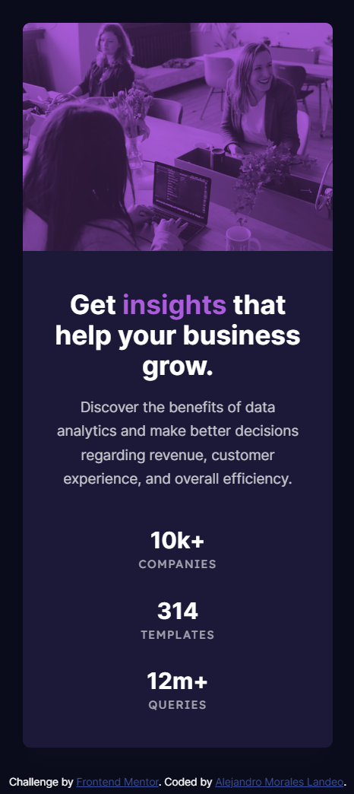

# Frontend Mentor - Stats preview card component solution

This is a solution to the [Stats preview card component challenge on Frontend Mentor](https://www.frontendmentor.io/challenges/stats-preview-card-component-8JqbgoU62). Frontend Mentor challenges help you improve your coding skills by building realistic projects. 

## Table of contents

- [Overview](#overview)
  - [The challenge](#the-challenge)
  - [Screenshot](#screenshot)
  - [Links](#links)
- [My process](#my-process)
  - [Built with](#built-with)
  - [What I learned](#what-i-learned)
- [Author](#author)
- [Acknowledgments](#acknowledgments)


## Overview

### The challenge

Users should be able to:

- View the optimal layout depending on their device's screen size

### Screenshot
Desktop preview:


Responsive:


### Links

- Solution URL: [Repository](https://github.com/amoraleslandeo/Results-summary-component.github.io)
- Live Site URL: [Web page](https://amoraleslandeo.github.io/Results-summary-component.github.io/)

## My process

### Built with

- Semantic HTML5 markup
- CSS custom properties
- Flexbox

### What I learned

I learned this attribute to generate a gradient color
```css
    background: linear-gradient(180deg, #75F 0%, #6943FF 0.01%, #2F2CE9 100%); 
```

I learned this attribute to generate a sorround shadow for a border
```css
    box-shadow: 0px 30px 60px 0px rgba(61, 108, 236, 0.15);
```

## Author

- Website - [Alejandro Morales Landeo](https://amoraleslandeo.github.io/personal-page.github.io/)
- Frontend Mentor - [@amoraleslandeo](https://www.frontendmentor.io/profile/amoraleslandeo)


## Acknowledgments

I wanna say thanks to my daily support [Roberto](https://github.com/RobertoSilvaZ) 🙌😉 who has become my developer Mentor and guide through this process that is just beggining.

